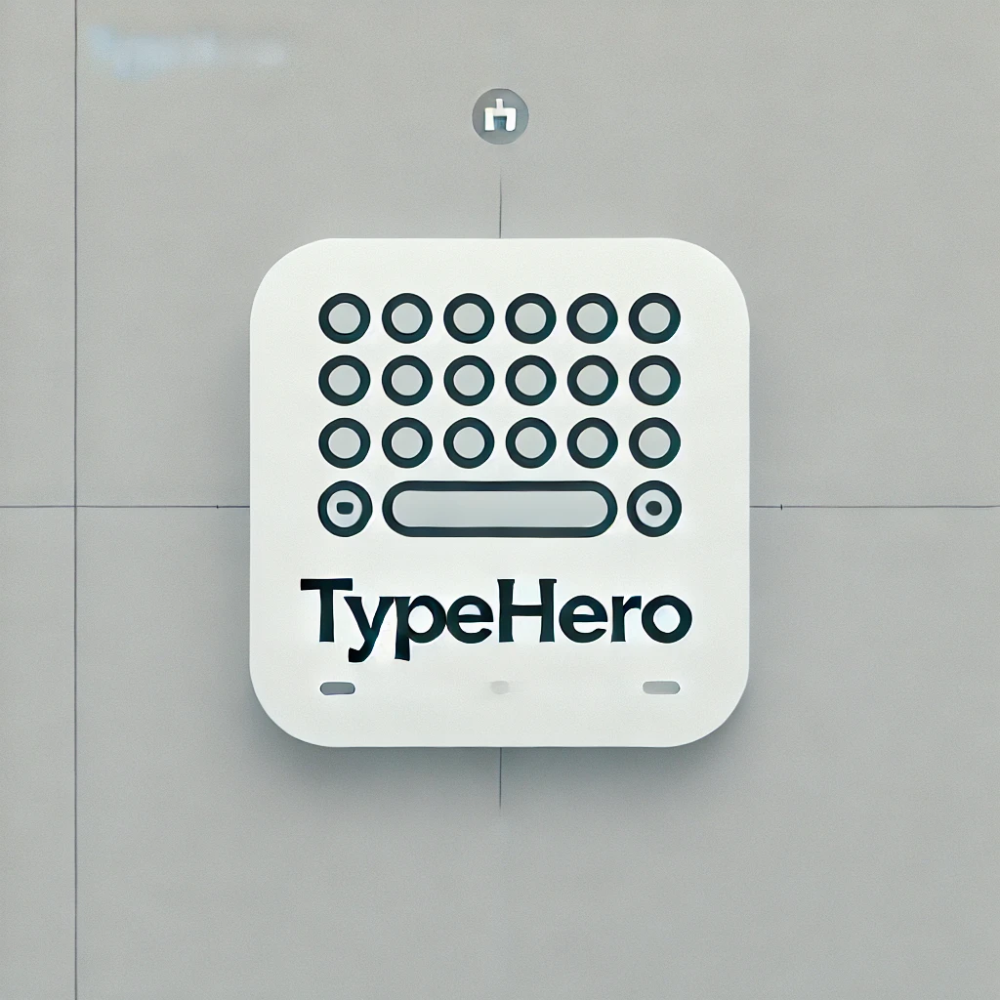

# Typehero 

A school project at the MES
Pure HTML, CSS and JS (no frameworks, no libs, noting)

It is deployed through Github Pages and can be accessed here: [Typehero](https://oxelf.github.io/typehero/)

The Server for the Leaderboard can be found [here](https://github.com/oxelf/typehero-server/) 

### Features
- Typing speed test
- Online Alltime Leaderboard
- See a timeline of your wpm and when you did mistakes
- different modes, such as words/quotes and how much words
- customizable theme of the website
- data is stored in local storage

It is responsive, but there is currently no input handling for mobile.

I got the words and quotes from this [repo](https://github.com/monkeytypegame/monkeytype/blob/master/frontend/static/quotes/german.json)
The icons are from the [heroicons library](https://heroicons.com).

The js code might be a bit messy, but if it works, it works.
